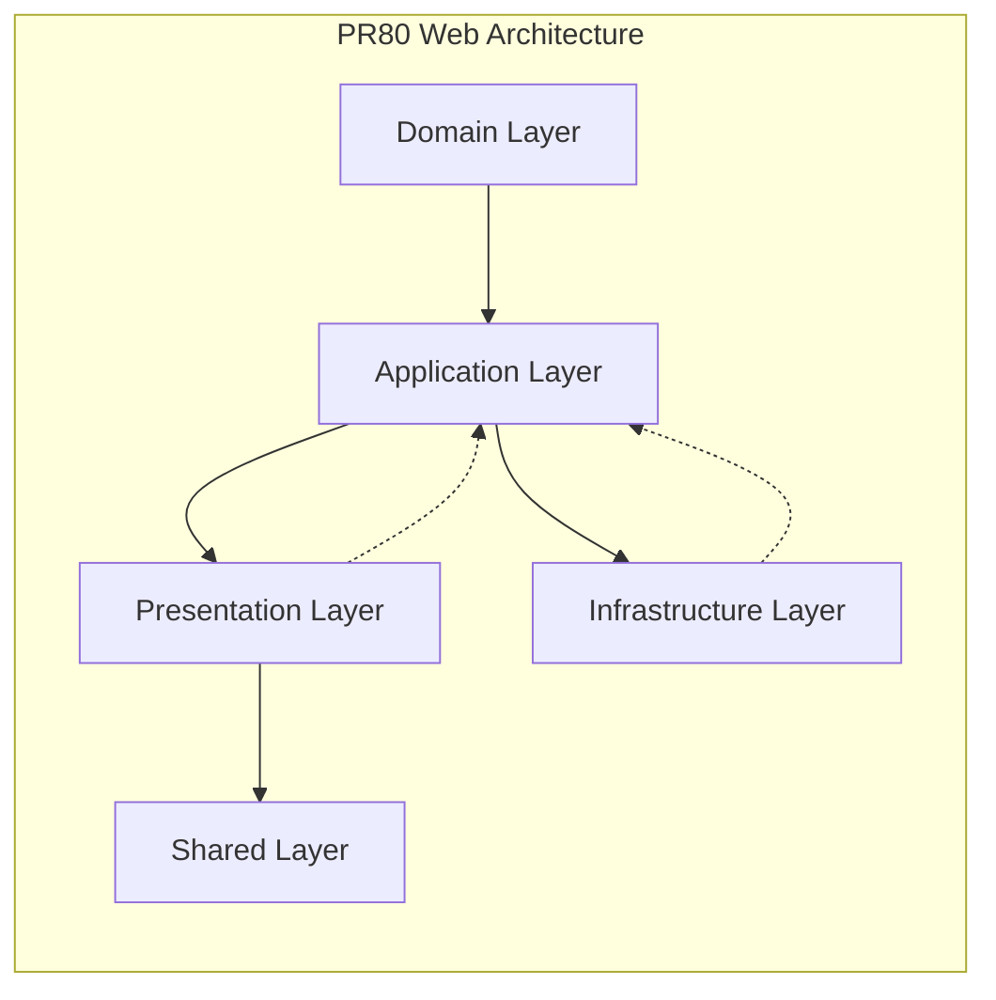

# System Patterns

## Architecture Overview
PR80 follows a clean architecture pattern with clear separation of concerns across both backend and frontend:

## Backend Architecture
The API follows a strict clean architecture with 4 distinct layers:

1. **Domain Layer** (`/domain`) - Core business entities and logic
   - Contains entity definitions (User, Role, DishOption, Order, etc.)
   - Pure business logic with zero external dependencies
   - Role-based access definitions (Chef, Waiter, Manager)
   - Value objects representing business concepts
   - Changes least frequently

2. **Application Layer** (`/application`) - Application use cases
   - Use case implementations with simple input/output interfaces
   - Interface definitions for repositories and services
   - Error handling definitions
   - Order management operations
   - Orchestrates domain entities and services
   - Defines what the application needs from external world

3. **Infrastructure Layer** (`/infras`) - Technical implementations
   - Database connections and repository implementations
   - Service implementations (JWT, real-time updates, etc.)
   - Dependency injection container
   - External system integrations
   - Framework-specific code (Express, database drivers)
   - Most likely to change when switching technologies

4. **Presentation Layer** (`/presentation`) - API endpoints and controllers
   - Controllers handling HTTP requests and responses
   - Data transfer objects (DTOs) for API formatting
   - Routers defining API paths
   - Middleware for request processing
   - Role-based request authentication
   - Input validation and response formatting

## Frontend Architecture
The web application follows a clean architecture adapted for frontend development:

1. **Domain Layer** (`/domain`) - Business logic and models
   - Business entities with validation and business rules
   - Domain services for complex cross-entity logic
   - Pure TypeScript/JavaScript with no framework dependencies
   - No imports from outer layers

2. **Application Layer** (`/application`) - Use cases and interfaces
   - Business workflows (use cases)
   - Interface definitions for stores, repositories, and services
   - Dependency contracts for what the app needs from external systems
   - Orchestrates domain models and services

3. **Presentation Layer** (`/presentation`) - React components and UI logic
   - React components organized by feature
   - Custom hooks connecting use cases to components
   - Pages as top-level route components
   - UI logic (form handling, events, formatting)
   - Layout components and providers

4. **Infrastructure Layer** (`/infrastructure`) - External implementations
   - Store implementations (state management)
   - Repository implementations (API communication)
   - Service implementations (notifications, storage, etc.)
   - API client configuration
   - Most likely to change when switching technologies

5. **Shared Layer** (`/shared`) - Reusable utilities and components
   - UI component library (design system)
   - Utility functions
   - Shared types and constants
   - Validation schemas

## Design Patterns
- **Repository Pattern** - Data access abstraction
- **Dependency Injection** - Service locator for dependencies
- **DTO Pattern** - Data transfer objects for API communication
- **Middleware Pattern** - Request processing pipeline
- **Observer Pattern** - For real-time updates and notifications
- **Error Handling** - Centralized error management
- **Role-based Access Control** - Permission management by user role

## Key Development Principles

### Core Architecture Principles
1. **Dependency Rule**: Inner layers never depend on outer layers
2. **Interface Segregation**: Define contracts in application layer
3. **Single Responsibility**: Each layer has one clear purpose
4. **Testability**: Mock external dependencies for unit tests
5. **Flexibility**: Easy to swap implementations without changing business logic

### Backend Development Guidelines
- Keep entities pure with no external dependencies
- Define interfaces in application layer
- Put business logic in appropriate layer (not in controllers)
- Use dependency injection for loose coupling
- Avoid creating "God" classes with too many responsibilities
- Never import infrastructure in domain/application layers
- Skip input validation in controllers

### Frontend Development Guidelines
- Keep domain models pure (no React or external dependencies)
- Inject dependencies through interfaces
- Put business logic in appropriate layers, not in React components
- Use hooks to connect use cases to React components
- Organize components by feature, not by type
- Use TypeScript for better type safety
- Import order: Domain → Application → Infrastructure → Shared

## Domain Entity Relationships

## Component Relationships
- Controllers use use cases to perform business operations
- Use cases interact with repositories and services
- Repositories implement data access logic
- Infrastructure provides implementations for interfaces
- Real-time services provide chef-waiter communication